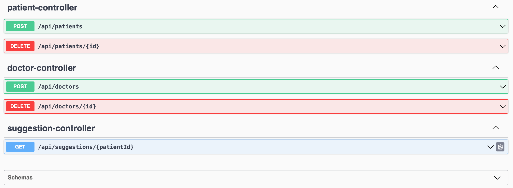

# MediConnect - Xcelore - Java Technical Assignment 

MediConnect is a backend application designed to manage doctors and patients, allowing doctors to register patients through a web or mobile portal. This repository contains the implementation of backend APIs to facilitate operations such as adding doctors, adding patients, and suggesting doctors based on patient symptoms.

## Features

- Add and remove doctors with details including name, city, email, phone number, and speciality.
- Add and remove patients with details including name, city, email, phone number, and symptom.
- API to suggest doctors based on patient symptoms and location.
- Validation of fields like name, city, email, and phone number to ensure data integrity.
- Unit tests for all service methods to ensure functionality and behavior.

## Doctor’s Entity

Doctors are stored in the database with the following properties:
- **Name:** Name of the doctor (minimum 3 characters).
- **Email:** Valid email address.
- **Phone Number:** Valid phone number (minimum 10 digits).
- **City:** City where the doctor practices (limited to Delhi, Noida, Faridabad).
- **Speciality:** Medical speciality of the doctor (Orthopaedic, Gynecology, Dermatology, ENT specialist).

## Patient’s Entity

Patients are stored with:
- **Name:** Name of the patient (minimum 3 characters).
- **Email:** Valid email address.
- **Phone Number:** Valid phone number (minimum 10 digits).
- **City:** City where the patient resides.
- **Symptom:** Medical symptom experienced by the patient (mapped to doctor specialities).

## API Endpoints

- **POST /api/doctors:** Add a new doctor.
- **DELETE /api/doctors/{id}:** Delete a doctor by ID.
- **POST /api/patients:** Add a new patient.
- **DELETE /api/patients/{id}:** Delete a patient by ID.
- **GET /api/patients/{id}:** Retrieve a patient by ID.
- **GET /api/suggest-doctors/{patientId}:** Suggest doctors based on patient symptoms and location.

## Validations

- **Name:** Minimum 3 characters.
- **City:** Maximum 20 characters.
- **Email:** Valid email format.
- **Phone Number:** Minimum 10 digits.

## Edge Cases

- If no doctors are available in the patient's city (outside Delhi, Noida, Faridabad), the API responds with "We are still waiting to expand to your location."
- If no doctors are available for the patient's symptom in their city, the API responds with "There isn’t any doctor present at your location for your symptom."

## Technologies Used

- **Spring Boot 3:** Framework for building Java applications.
- **Hibernate:** ORM tool for database operations.
- **Swagger:** API documentation tool (optional).
- **JUnit 5** and **Mockito:** Unit testing frameworks.

## Test Cases

### Unit Tests

- **testAddDoctor:** Verifies adding a new doctor.
- **testSuggestDoctors:** Verifies suggesting doctors based on city and speciality.
- **testAddPatient:** Verifies adding a new patient.
- **testGetPatientById:** Verifies retrieving a patient by ID.

Each test case mocks repository behavior and verifies service method interactions, ensuring correct functionality and behavior of the APIs.

## Getting Started

1. Clone the repository:
   ```bash
   git clone https://github.com/akhtaransari/mediconnect.git
   cd mediconnect
   ```

2. Build and run the application:
   ```bash
   mvn spring-boot:run
   ```

3. Access the API documentation:
   - Local: http://localhost:8080/swagger-ui.html (if Swagger is enabled)


## Access Live

1. Access the API documentation:
   - : http://thegreattech.com/swagger-ui/index.html (Swagger-UI)
## Screenshots



## Contributors

- Akhtar Ansari - Backend Java Developer

## License

This project is licensed under the MIT License - see the LICENSE file for details.
